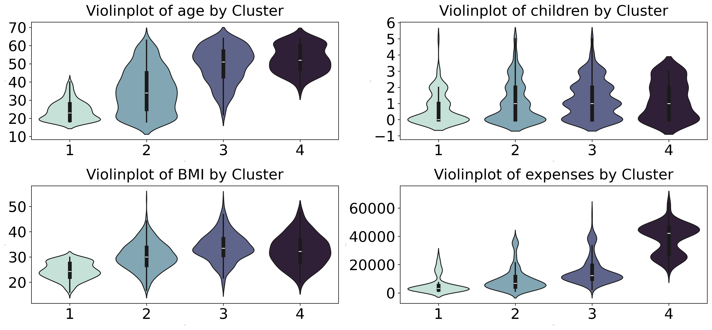

# Portfolio
### Education
Chemistry and Management, Bsc
  
## Projects
### [Case Study: CRM Clustering](https://github.com/moritz-podiebrad/CRM-Clustering)

Developed a clustering model using real customer data to segment
fitness customers and derive actionable CRM insights.

