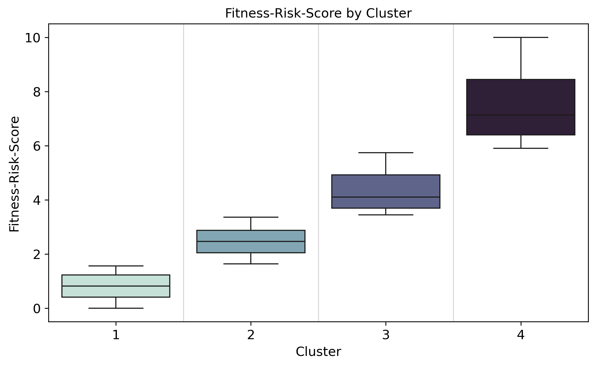

# Projects
## [Case Study: CRM Clustering](https://github.com/moritz-podiebrad/CRM-Clustering)

Developed a clustering model using real customer data to segment
fitness customers and derive actionable CRM insights. Project in cooperation with [Franziska Reiher](https://github.com/franziska-reiher).

This project focused on clustering existing customers of a fitness e-commerce company using the **Fitness-Risk-Score** as the key feature. The feature engineering process involved combining customer attributes like age, BMI, smoking status, and children to create an interpretable metric. This transformation enabled meaningful clustering and provided actionable insights for targeted strategies. This work highlights the importance of feature engineering in deriving valuable insights and improving model effectiveness.

